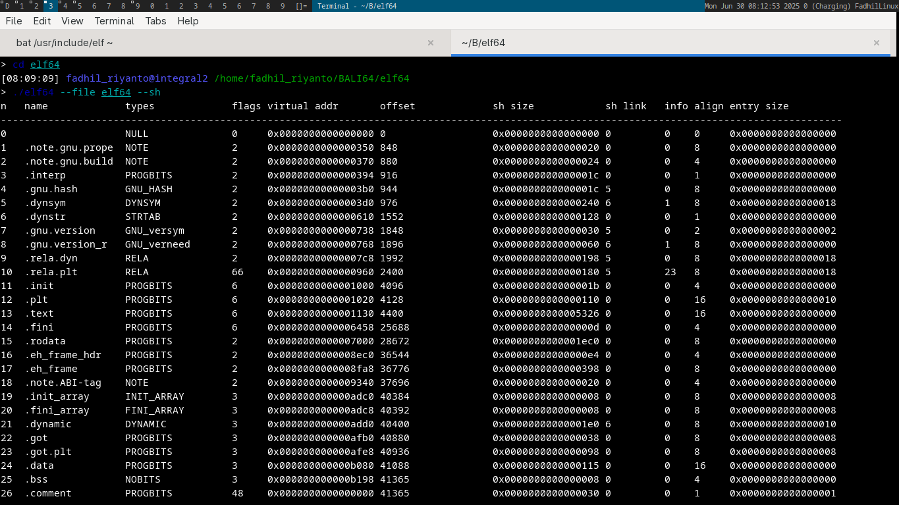
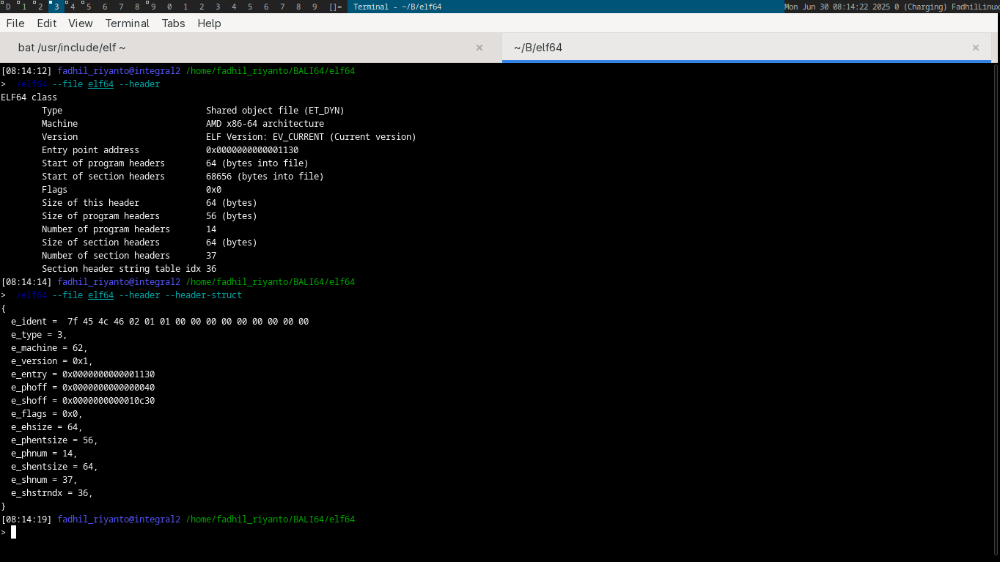
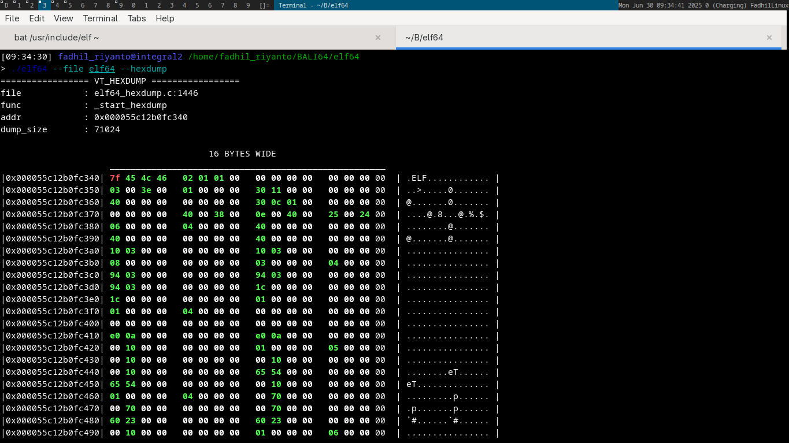

# ELF (Executable and Linkable Format)
this is dumb tool used to inspect Linux ELF binary structure and also act as hexdump.

## Introduction

Executable and Linkable Format (ELF), is the default binary format on Linux-based systems.

[image source](https://gist.github.com/x0nu11byt3/bcb35c3de461e5fb66173071a2379779)

# compiling & use
the compile process is very easy, just type `make`. by default its compile debug version (with symbol inside).

## example usage
#### hexdump only (any file)
`./elf64 --file elf64 --hexdump`

#### show user friendly header
`./elf64 --file elf64 --header`

#### dump ELF header as linux kernel struct format
`./elf64 --file elf64 --header --header-struct`

#### dump ELF program header
`./elf64 --file elf64 --ph`

#### dump ELF section header
`./elf64 --file elf64 --sh`

## screenshots

# useful resources
- [https://git.kernel.org/pub/scm/linux/kernel/git/torvalds/linux.git/tree/include/uapi/linux/elf.h#n234](https://git.kernel.org/pub/scm/linux/kernel/git/torvalds/linux.git/tree/include/uapi/linux/elf.h#n234)
- [https://0xax.gitbooks.io/linux-insides/content/Theory/linux-theory-2.html](https://0xax.gitbooks.io/linux-insides/content/Theory/linux-theory-2.html)

# todo
- print custom section such `.shrtab`, `.text`
- assembly dumping (objdump like), soon...
- add option to show all symbol inside of shdr
- add support assembly dumping for other arch (such aarch64, atmel 8 bit, etc). soon